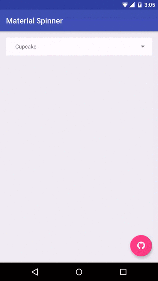

<h1 align="center">YhSpinner</h1>

<p align="center">
  <a target="_blank" href="https://developer.android.com/reference/android/os/Build.VERSION_CODES.html#ICE_CREAM_SANDWICH"></a>
  <a target="_blank" href="LICENSE"></a>
</p>

___



Usage
-----
修改了Nice Spinner，使其可以添加entries，并自由修改text的属性，而不会影响到下拉列表框的属性
Add the spinner to your layout XML:

```xml
<com.yh.yhSpinner.YhSpinner
    android:id="@+id/spinner"
    android:layout_width="match_parent"
    android:layout_height="wrap_content"/>
```

Add items to the spinner and listen for clicks:

```java
YhSpinner spinner = (YhSpinner) findViewById(R.id.spinner);
spinner.setItems("Ice Cream Sandwich", "Jelly Bean", "KitKat", "Lollipop", "Marshmallow");
spinner.setOnItemSelectedListener(new YhSpinner.OnItemSelectedListener<String>() {

  @Override public void onItemSelected(YhSpinner view, int position, long id, String item) {
    Snackbar.make(view, "Clicked " + item, Snackbar.LENGTH_LONG).show();
  }
});
```

You can add attributes to customize the view. Available attributes:

| name                    | type      | info                                                   |
|-------------------------|-----------|--------------------------------------------------------|
| yh_entries           | reference     | sets the arrays on the drop-down arrow                  |
| yh_arrow_tint           | color     | sets the color on the drop-down arrow                  |
| yh_hide_arrow           | boolean   | set to true to hide the arrow drawable                 |
| yh_background_color     | color     | set the background color for the spinner and drop-down |
| yh_background_selector  | integer   | set the background resource for the dropdown items     |
| yh_text_color           | color     | set the text color                                     |
| yh_dropdown_max_height  | dimension | set the max height of the drop-down                    |
| yh_dropdown_height      | dimension | set the height of the drop-down                        |
| yh_padding_top          | dimension | set the top padding of the drop-down                   |
| yh_padding_left         | dimension | set the left padding of the drop-down                  |
| yh_padding_bottom       | dimension | set the bottom padding of the drop-down                |
| yh_padding_right        | dimension | set the right padding of the drop-down                 |
| yh_popup_padding_top    | dimension | set the top padding of the drop-down items             |
| yh_popup_padding_left   | dimension | set the left padding of the drop-down items            |
| yh_popup_padding_bottom | dimension | set the bottom padding of the drop-down items          |
| yh_popup_padding_right  | dimension | set the right padding of the drop-down items           |

Download
--------

Download [the latest AAR](https://repo1.maven.org/maven2/com/jaredrummler/material-spinner/1.3.1/material-spinner-1.3.1.aar) or grab via Gradle:

```groovy
compile 'com.huyuanhao:yhSpinner:1.0'
```
or Maven:
```xml
<dependency>
	<groupId>com.huyuanhao</groupId>
	<artifactId>yhSpinner</artifactId>
	<version>1.0</version>
	<type>pom</type>
</dependency>
```

Thanks
----------------

[Nice Spinner](https://github.com/arcadefire/nice-spinner) by Angelo Marchesin